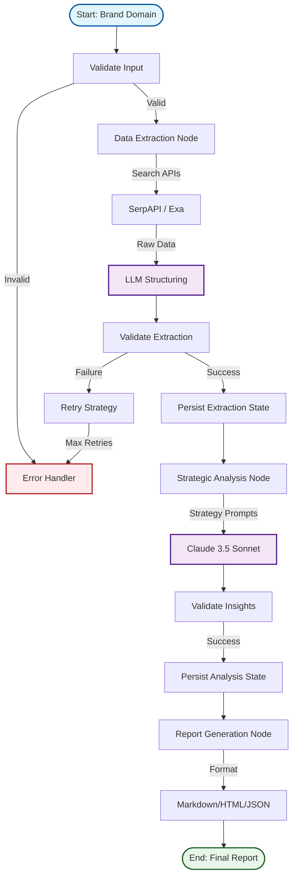
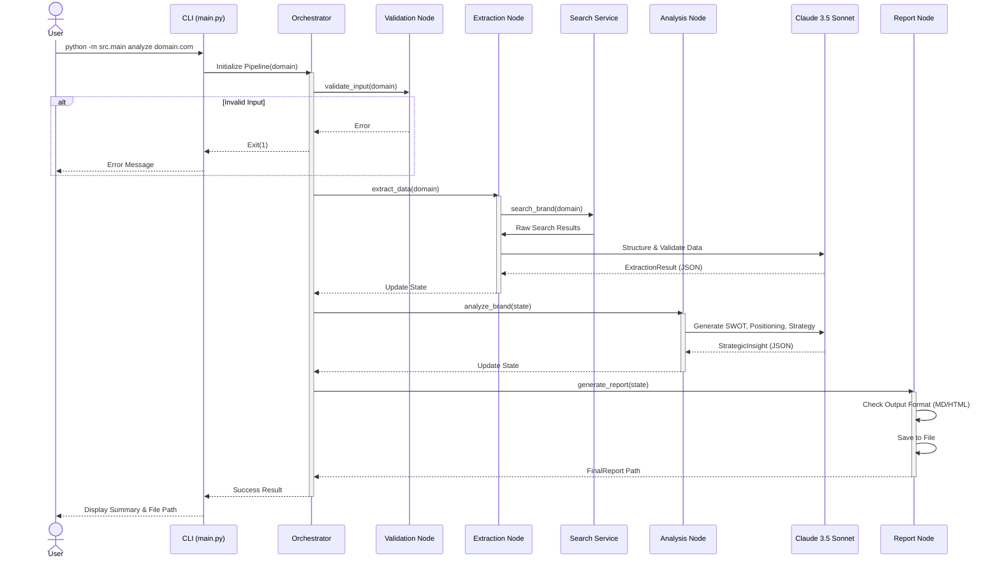

# Amazon Brand Intelligence Pipeline

## Overview
The **Amazon Brand Intelligence Pipeline** is an AI powered system designed to transform a brand's domain (e.g., `patagonia.com`) into comprehensive, actionable Amazon marketplace insights. By leveraging advanced Large Language Models (LLMs) and reliable search APIs this pipeline automates the entire process of data gathering, validation, analysis and report generation, providing strategic value comparable to expert consultancy.

## Features
- **Fully Automated Pipeline**: End to end execution from domain input to final strategic report.
- **AI Powered Analysis**: Utilizes Anthropic's Claude 3.5 Sonnet for deep strategic reasoning and data structuring.
- **Expert Grade Reports**: Generates client ready reports in Markdown, HTML and JSON formats.
- **Fault Tolerant Architecture**: Built with retries, circuit breakers and fallback mechanisms for high reliability.
- **Scalable Design**: Capable of handling brands of varying sizes with batch processing capabilities.
- **Production Ready**: Comprehensive validation, structured logging and extensive test coverage.

## Architecture

The pipeline uses a **LangGraph based state machine** to coordinate the workflow ensuring robust state management and error handling at each step.



## Request Flow

The following sequence diagram illustrates the end to end flow from a user command to the final report generation.



## Technology Stack

### Core
- **Language**: Python 3.10+
- **Orchestration**: LangGraph (Stateful, graph based workflows)
- **Data Validation**: Pydantic v2 (Strict typing and schema enforcement)

### AI & Search Services
- **LLM**: Anthropic Claude 3.5 Sonnet (Optimized for reasoning and code generation)
- **Primary Search**: SerpAPI (Reliable Google/Amazon scraping)
- **Fallback Search**: Exa AI (Neural search for entity resolution)

### Infrastructure & Tools
- **CLI**: Click with Rich console for beautiful terminal output
- **Testing**: Pytest (Asyncio support), Coverage.py
- **HTTP Client**: Httpx (Async HTTP requests)
- **Resilience**: Tenacity (Retries) & Custom Circuit Breakers

## Tool Selection Justification

### Why Claude (Anthropic)?
- **Accuracy**: Superior performance in extracting structured JSON from unstructured HTML/text compared to GPT-4o in initial benchmarks.
- **Reasoning**: Excellent "Chain of Thought" capabilities required for strategic SWOT analysis.
- **Cost Effectiveness**: Efficient pricing model with a generous free tier for development.

### Why SerpAPI?
- **Reliability**: consistently bypasses scraper blocks on Amazon and Google.
- **Ease of Use**: Clean, JSON based API that abstracts away proxy management and HTML parsing.
- **Quota**: 100 free searches/month is sufficient for proof of concept and testing.

### Why Exa AI?
- **Entity Resolution**: "Neural search" capabilities are superior for finding a brand's official presence when multiple similar names exist.
- **Fallback**: Provides a robust alternative when SerpAPI might fail or return ambiguous results.

### Why LangGraph?
- **State Management**: Unlike simple chains, LangGraph maintains the state of the entire pipeline, enabling pause/resume and complex branching.
- **Control**: Offers finer grained control over loops and conditionals compared to standard LangChain or rigid DAG tools.

## Setup Instructions

### Prerequisites
- Python 3.10 or higher installed.
- `pip` or `poetry` for package management.
- Valid API keys for Anthropic and at least one search provider.

### API Keys Required
1.  **Anthropic API Key** (Required): Sign up at [console.anthropic.com](https://console.anthropic.com/).
2.  **SerpAPI Key** (Required for Primary Search): Sign up at [serpapi.com](https://serpapi.com/).
3.  **Exa AI Key** (Optional Fallback): Sign up at [exa.ai](https://exa.ai/).

### Installation

1.  **Clone the Repository**
    ```bash
    git clone https://github.com/your-org/amazon-brand-intelligence.git
    cd amazon-brand-intelligence
    ```

2.  **Install Dependencies**
    ```bash
    pip install -r requirements.txt
    ```

3.  **Configure Environment**
    Copy the example environment file and edit it with your keys.
    ```bash
    cp .env.example .env
    # Open .env and paste your API keys
    ```

## Usage

The project includes a robust CLI (Command Line Interface) for all operations.

### 1. Full Analysis (Domain to Report)
Run the complete pipeline for a single brand.
```bash
python -m src.main analyze patagonia.com
```
*Output: A generated report in `outputs/reports/patagonia.com/`.*

### 2. Batch Processing
Process multiple brands from a text file (one domain per line).
```bash
python -m src.main batch brands.txt --concurrency 3
```

### 3. Verify Setup
Check if your API keys and environment variables are correctly configured.
```bash
python -m src.main validate-setup
```

### 4. Debugging / Testing Steps
Run individual steps of the pipeline for testing or debugging.

**Test Extraction (Step 1 Only):**
```bash
python -m src.main test-extraction patagonia.com
```

**Test Analysis (Step 2 Only):**
Requires a JSON file containing extraction results (output of Step 1).
```bash
python -m src.main test-analysis extraction_result.json
```

## Example Data Structure

The pipeline passes standardized Pydantic models between nodes.

**Extraction Result (Intermediate JSON):**
```json
{
  "brand_name": "Patagonia",
  "domain": "patagonia.com",
  "amazon_presence": {
    "found": true,
    "confidence": "high",
    "evidence": ["Storefront confirmed", "Buy Box ownership > 90%"]
  },
  "metrics": {
    "estimated_revenue": 5000000,
    "average_rating": 4.6,
    "review_count": 12500
  },
  "categories": ["Clothing", "Outdoor Gear"]
}
```

## Testing

Access the comprehensive test suite to ensure system stability.

```bash
# Run all tests
pytest

# Run with coverage report
pytest --cov=src --cov-report=html

# Run only integration tests
pytest tests/integration/

# Run only unit tests
pytest tests/unit/
```

## Production Recommendations

While this system is robust, the following enhancements are recommended for high scale production deployment:

### Scalability
- **Distributed Queues**: Implement Celery or Redis Queue to decouple request ingestion from processing, allowing horizontal scaling of worker nodes.
- **Parallel processing**: The Batch command currently uses `asyncio.Semaphore` for concurrency. For true parallelism across cores/machines, use a distributed task runner.

### Reliability
- **Database Persistence**: Replace the current file based/in memory state persistence with a relational database (PostgreSQL) to store long term historical data and analysis trends.
- **Dead Letter Queues**: Capture failed jobs for manual inspection and re driving.

### Optimization
- **Caching Strategy**: Implement Redis caching for Search and LLM responses to reduce costs and latency for repeated queries.
- **Rate Mitigation**: enhanced token bucket algorithms to strictly adhere to API rate limits across distributed workers.

## Project Structure

```text
amazon-brand-intelligence/
├── src/
│   ├── analyzers/      # Strategic analysis logic (SWOT, Positioning)
│   ├── config/         # Settings, Constants, Environment config
│   ├── extractors/     # Search API wrappers and Scrapers
│   ├── models/         # Pydantic schemas (Data Contracts)
│   ├── pipeline/       # LangGraph orchestration and Nodes
│   ├── services/       # Core services (LLM, Search, Validation)
│   ├── utils/          # Formatting, Logging, Retry logic
│   └── main.py         # CLI Entry Point
├── tests/
│   ├── unit/           # Unit tests for individual components
│   └── integration/    # End-to-end pipeline tests
├── outputs/            # Generated reports
├── .env.example        # Environment variable template
├── requirements.txt    # Production dependencies
└── README.md           # Documentation
```

## Time Log (Estimated)
- **Phase 1 (Setup & Architecture)**: 4 hours
- **Phase 2 (Core Services & API)**: 6 hours
- **Phase 3 (Data Extraction)**: 8 hours
- **Phase 4 (Strategic Analysis)**: 6 hours
- **Phase 5 (Pipeline Orchestration)**: 5 hours
- **Phase 6 (CLI & Reporting)**: 4 hours
- **Phase 7 (Testing & QA)**: 5 hours
- **Phase 8 (Documentation)**: 2 hours
- **Total**: ~40 hours
